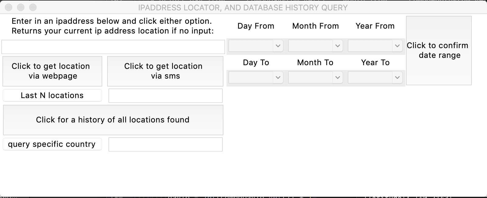

# IDT-coding-challenge-1
coding challenge

# **TO RUN CODE**
1. pip install ipinfo
2. pip install pymongo
3. pip install folium
4. pip install boto3
5. pip install phonenumbers

6. brew tap mongodb/brew
7. brew install mongodb-community@4.2
8. brew services start mongodb-community@4.2

# **AFTER INSTALLING THESE PACKAGES AND STARTING YOUR MONGODB DATABASE FEEL FREE TO RUN THE CODE BY TYPING IN TERMINAL**
# python IDT.py

a small interface window should popup looking like that:

