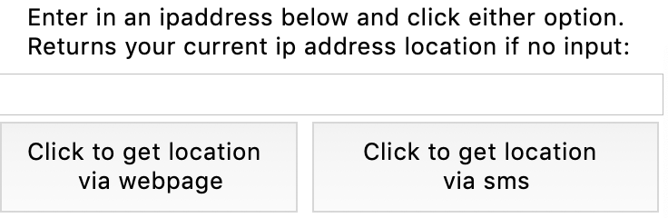
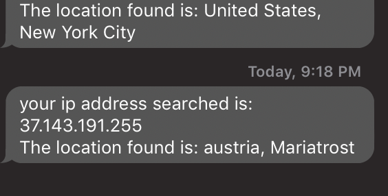

# IDT-coding-challenge-1
coding challenge

# **TO RUN CODE**
1. pip install ipinfo
2. pip install pymongo
3. pip install folium
4. pip install boto3
5. pip install phonenumbers

6. brew tap mongodb/brew
7. brew install mongodb-community@4.2
8. brew services start mongodb-community@4.2

# **AFTER INSTALLING THESE PACKAGES AND STARTING YOUR MONGODB DATABASE FEEL FREE TO RUN THE CODE BY TYPING IN TERMINAL**
# python IDT.py

a small interface window should popup looking like that:

1. **The first entry box is for you to key in a IP address**
I got my list of IP address test results from this: https://www.nirsoft.net/countryip/index.html

after you copy paste into the entry box, you can click the two options underneathe the entry box

  * Leaving the entry box blank and clicking "get location via webpage" will retrieve your current IP address and open up  
  a webpage showing you where its geolocation is
  * entering in an ip address from somewhere else will open up a webpage of the ip address' location
  * click to get location via sms will open up a pop up asking for your country code and to type in your phone number
  * clicking the button should send a message of the IP addresses location to your phone, **BUT please use your own AMAZON          SNS, mine is a little wonky, it was working prior to making this README.md**
  (**I CREATED A NEW AMAZON SNS ACCOUNT AND IT WORKS SO IDK WHATS GOING ON**)
  (**REPLACED OLD ACCESS KEYS WITH NEW ONE)
  (**YOU SHOULD RECEIVE A MSG LIKE THIS**)
  

2. **get last n locations basically retrieves the last n locations in DB**
3. **click for a history of all locations returns all queries in DB**
4. **query specific country returns a history of the queries found in specific country**

5. **the dates are kept in UTC as per mongodb requirements, so searching based off EST time might not return results, because records are kept in UTC, which might be tomorrow, so try 17 FEB 2020, if you added some records on 16 FEB 2020, and don't see any.**
